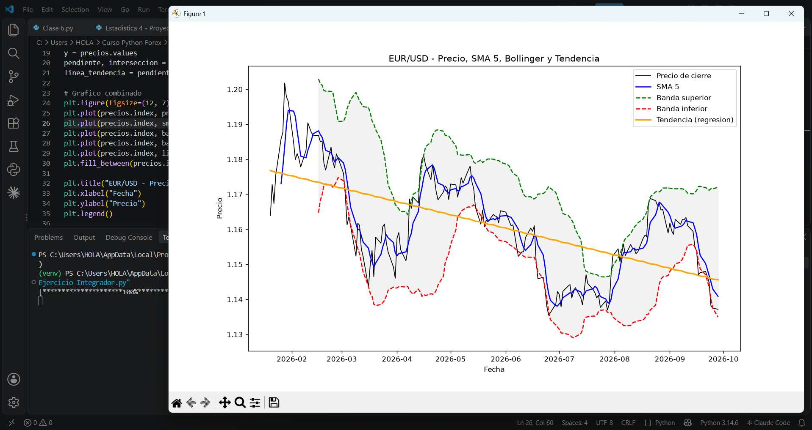
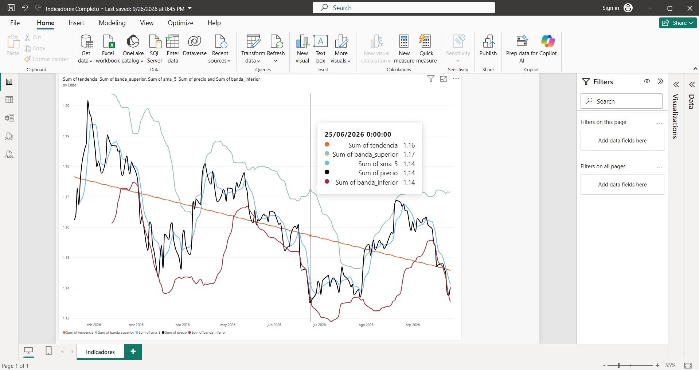
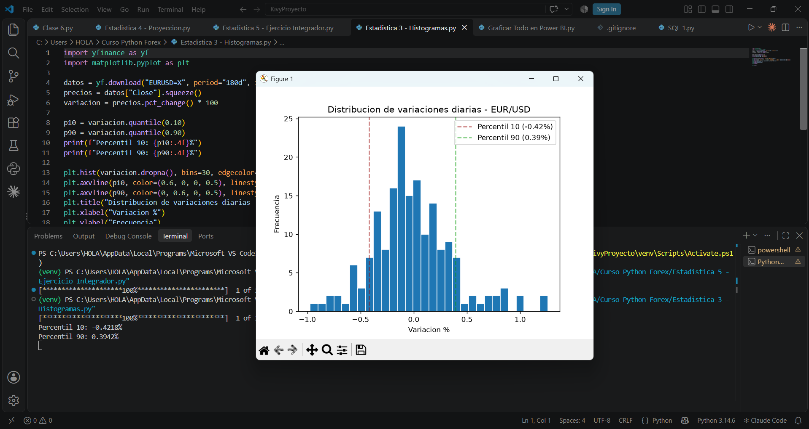

# Análisis Técnico de Forex con Python

Proyecto de análisis técnico aplicado al par EUR/USD, combinando Python, SQL y Power BI para calcular indicadores financieros y visualizar tendencias de mercado.

## 🎯 Objetivo

Aplicar técnicas de análisis de datos (estadística, series temporales, visualización) a datos reales de mercado Forex, como base para servicios de análisis de datos freelance.

## 🛠️ Tecnologías utilizadas

- **Python:** pandas, numpy, matplotlib, yfinance
- **SQL:** SQLite (consultas, agregaciones, GROUP BY)
- **Power BI:** dashboards interactivos, conexión ODBC a SQLite
- **Excel:** tablas dinámicas, fórmulas avanzadas, formato condicional

## 📊 Indicadores implementados

- Media Móvil Simple (SMA)
- Índice de Fuerza Relativa (RSI)
- Bandas de Bollinger
- Correlación entre pares de divisas
- Regresión lineal (tendencia)
- Detección de rupturas de soporte/resistencia

## 📁 Estructura del proyecto

- `Clase 1-7.py`: fundamentos de Python aplicados a datos financieros
- `SQL 1-4.py`: modelado y consultas en base de datos SQLite
- `Estadistica 1-4.py`: análisis estadístico aplicado (volatilidad, correlación, distribución, tendencia)

## 📈 Capturas del proyecto

### Bandas de Bollinger + SMA + Tendencia

### Dashboard interactivo en Power BI

### Distribución de variaciones diarias (RSI y percentiles)

## 🚀 Cómo ejecutar

1. Clona este repositorio
2. Instala las dependencias: `pip install pandas numpy matplotlib yfinance`
3. Ejecuta cualquier script: `python "Estadistica 4 - Proyeccion.py"`
